### 🧑‍💻 HireSense - AI Powered Job Portal Web Application
---

### 🚀 Project Overview
   A modern, full-stack job portal platform built with **Spring Boot (Java)** and **React + Vite**.  
   It allows **candidates** to browse and apply for jobs, **employers** to post and manage job listings, and **admins** to oversee the entire system.
   This project also includes optional AI capabilities via Groq api for resume analysis, AI job matching & scoring, candidate ranking, and job description generation.

    
------------------------------------------------------------------------------------------------------------
### ⭐ Features

  ### 🤖 AI Features (Powered by Groq)
   - **Smart Resume Analysis**: Automatically extracts skills, experience, and education from resumes.
   - **AI Job Matching**: Calculates a match score (0-100%) between candidates and job requirements.
   - **Automated Ranking**: Ranks applicants based on their relevance to the job description.
   - **Job Description Generator**: Helps employers create detailed job posts from simple prompts.
   - **AI Career Assistant**: A chat interface for career advice and interview preparation.

  #### 👨‍🎓 Candidates
  
   - Browse & filter jobs (location, type, experience, keywords)
   - View job details with company info
   - Apply with cover letter + resume upload
   - Track application status
   - Save jobs for later
   - Manage profile

  #### 👨‍💼 Employers
    
   - Create & manage job posts
   - View applicants per job
   - Update application status:
   - Pending → Reviewed → Shortlisted → Accepted → Rejected
   - Company profile management
   - Email notifications to candidates

  #### 🛡️ Admins

   - Manage users, companies, jobs, and applications
   - View platform-wide statistics
   - Complete system oversight
------------------------------------------------------------------------------------------------------------
### 🏗️ System Architecture
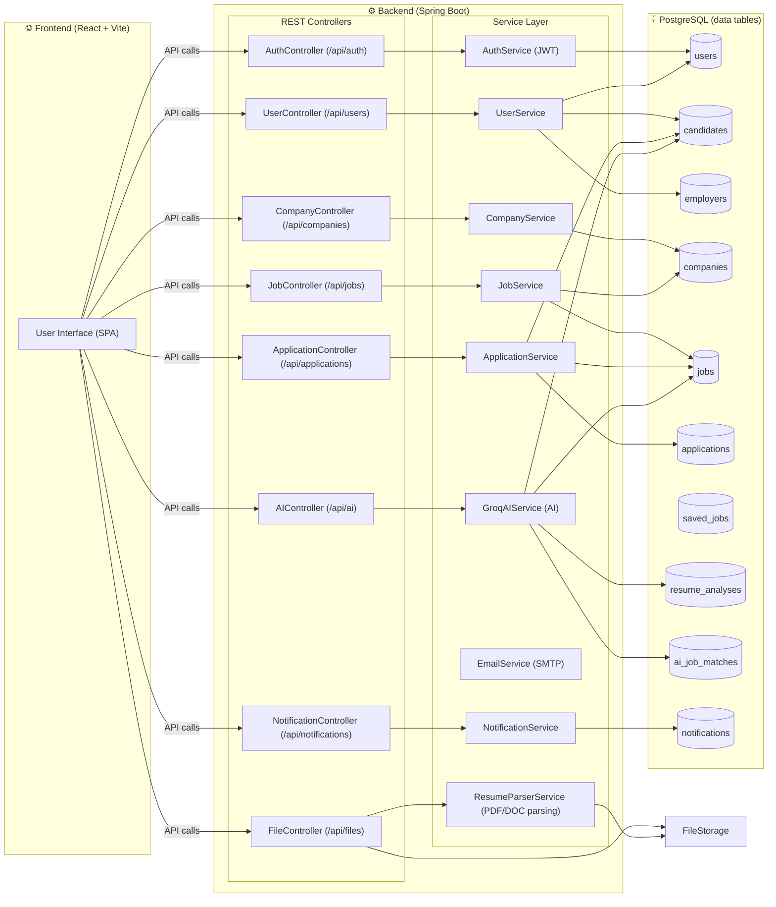
-------------------------------------------------------------------------------------------------

## 📊 Data Model (ER Diagram)
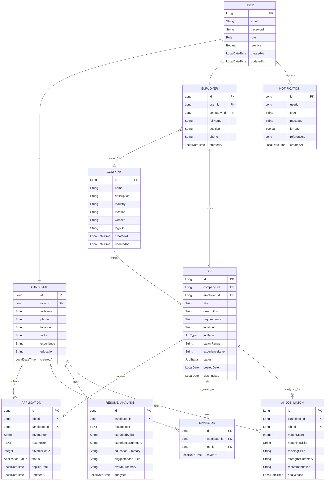

----------------------------------------------------------------------------------------------
### 🔐 Authentication Flow
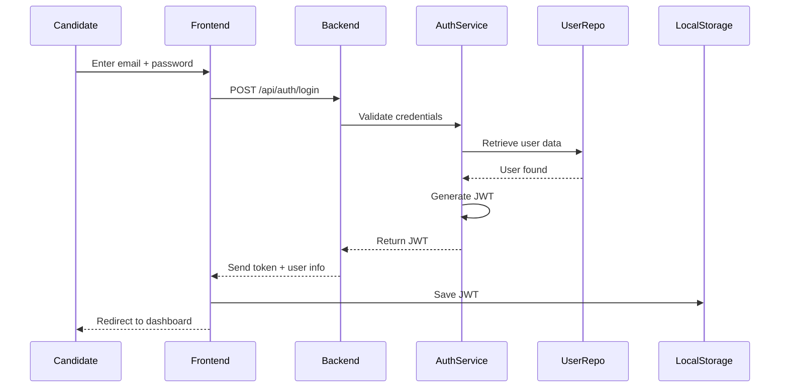
------------------------------------------------------------------------------------------------
### 📸 Screenshots

#### Landing Page
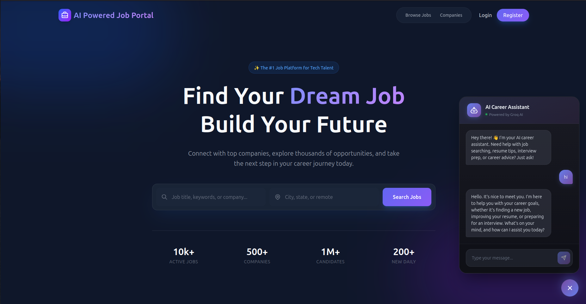

#### Registration Page
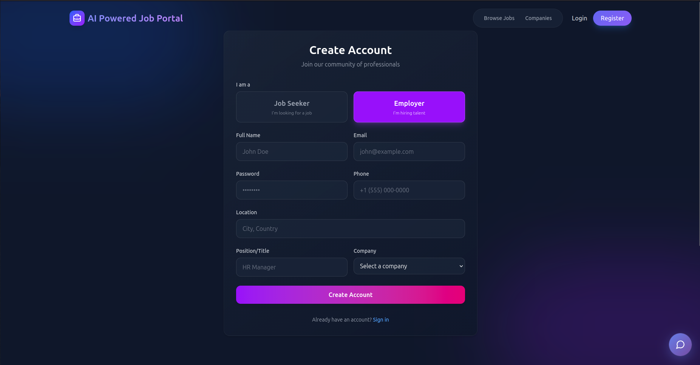

### Admin Panel
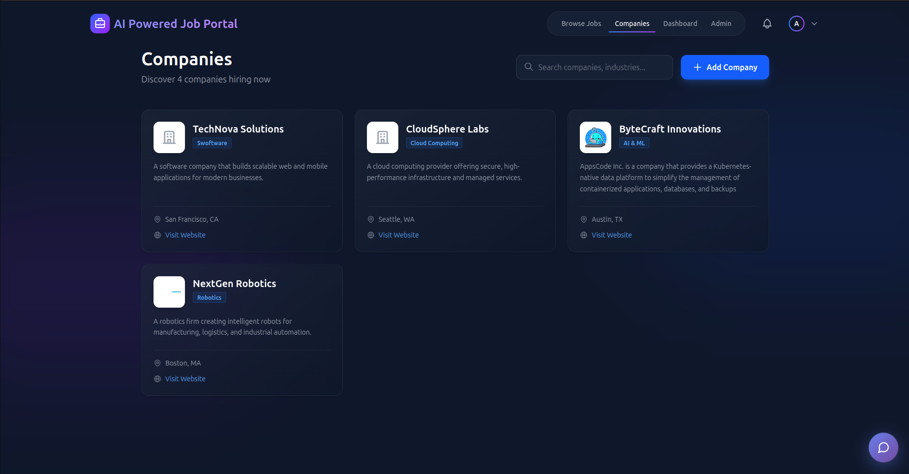

### Job Posting 
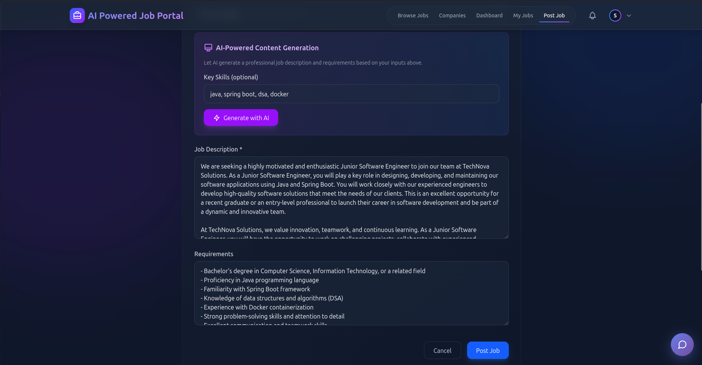

### AI Rank Candidates 
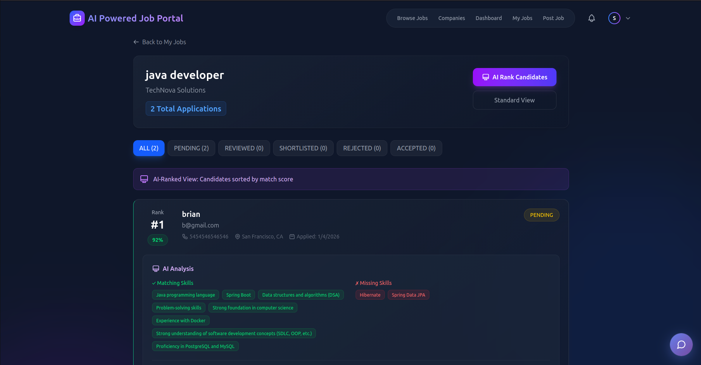

### Employer 
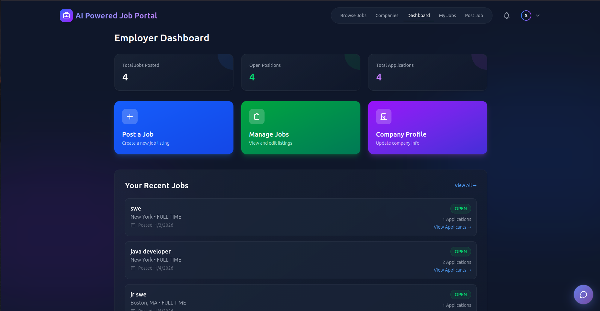

### Apply Job   
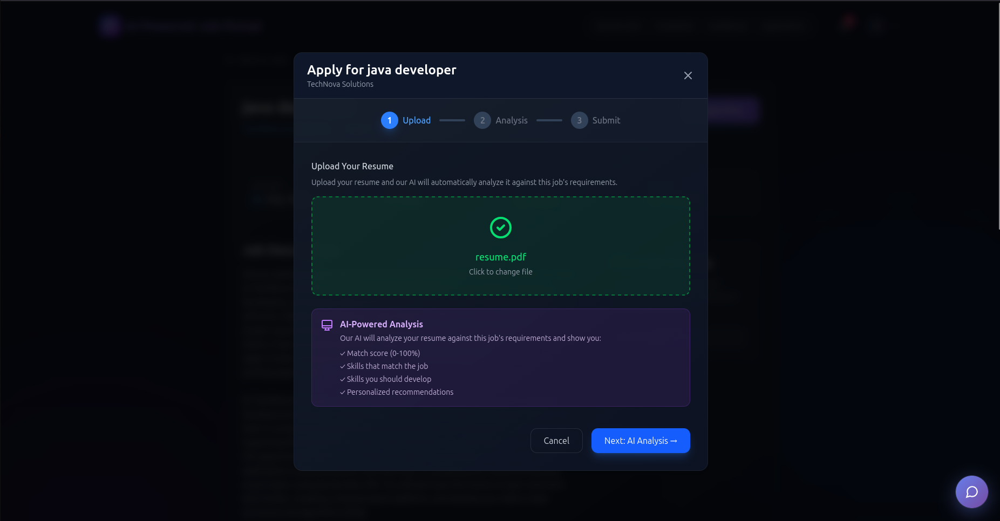

### Candidate 
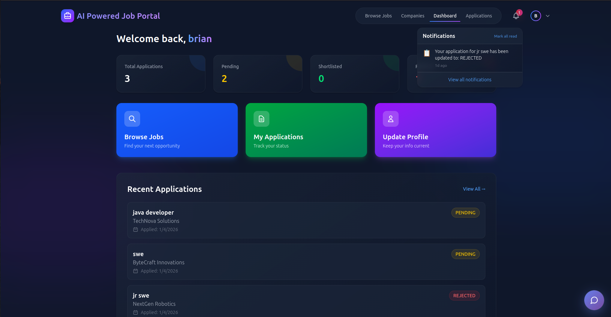

------------------------------------------------------------------------------------------------
### ✅ API Endpoints

### Authentication (`/api/auth`)
- POST `/api/auth/register` — Register a new user (body: RegisterRequest)
- POST `/api/auth/login` — Login & get JWT (body: LoginRequest)

### Users (`/api/users`)
- GET `/api/users/profile` — Get current user profile (Authenticated)
- PUT `/api/users/profile` — Update current user profile (Authenticated, body: ProfileUpdateRequest)
- PUT `/api/users/change-password` — Change password (Authenticated, body: PasswordChangeRequest)

### Jobs (`/api/jobs`)
- GET `/api/jobs` — Get all jobs (pagination + sorting) (Public)
- GET `/api/jobs/search` — Search jobs (keyword, location, jobType, experienceLevel, companyId, pagination) (Public)
- GET `/api/jobs/{id}` — Get job details (Public)
- POST `/api/jobs` — Create a job (Employer only, body: JobRequest)
- PUT `/api/jobs/{id}` — Update a job (Employer only, body: JobRequest)
- DELETE `/api/jobs/{id}` — Delete a job (Employer only)
- GET `/api/jobs/my-jobs` — Get employer's own posted jobs (Employer only)

### Companies (`/api/companies`)
- GET `/api/companies` — Get all companies (paginated) (Public)
- GET `/api/companies/{id}` — Get company details (Public)
- POST `/api/companies` — Create company (Admin only, body: CompanyRequest)
- PUT `/api/companies/{id}` — Update company (Admin only, body: CompanyRequest)
- DELETE `/api/companies/{id}` — Delete company (Admin only)

### Applications (`/api/applications`)
- POST `/api/applications` — Apply for a job (Candidate only, body: ApplicationRequest)
- GET `/api/applications/my-applications` — Get candidate applications (Candidate only)
- GET `/api/applications/job/{jobId}` — Get all applications for a job (Employer only)
- GET `/api/applications/{id}` — View application by ID (Candidate or Employer)
- PUT `/api/applications/{id}/status?status=STATUS` — Update application status (Employer only)

### Files (`/api/files`)
- POST `/api/files/upload` — Upload a file (authenticated). Params: `file` (multipart), optional `type` (resume/profile/document). Returns `fileUrl`, `fileName`, `fileType`.
- POST `/api/files/upload-resume` — Upload resume and return extracted text (authenticated). Returns `fileUrl`, `extractedText`, etc.
- GET `/api/files/download/{type}/{filename}` — Download/view a file (public for downloads)
- DELETE `/api/files/delete/{type}/{filename}` — Delete an uploaded file (authenticated)

### AI (Groq) (`/api/ai`)
- POST `/api/ai/analyze-resume` — Analyze resume text (body: AIResumeAnalysisRequest) (public)
- POST `/api/ai/analyze-resume/{candidateId}` — Analyze resume and store it for candidate (Candidate only, body: {"resumeText": "..."})
- GET `/api/ai/resume-analysis/{candidateId}` — Get stored resume analysis (public if accessible)
- POST `/api/ai/match-score` — Calculate match score ad-hoc (body: AIMatchScoreRequest)
- POST `/api/ai/match-score/{candidateId}/{jobId}` — Calculate & store match score (public)
- GET `/api/ai/match-score/{candidateId}/{jobId}` — Get stored match score (or calculate) (public)
- POST `/api/ai/analyze-job-match` — Analyze a resume against a job (Candidate only, body: {"resumeText","jobTitle","jobDescription","jobRequirements"})
- POST `/api/ai/generate-job-description` — Generate job description (Employer only, body: AIJobDescriptionRequest)
- POST `/api/ai/analyze-applicants/{jobId}` — Trigger batch analysis of applicants for a job (Employer only)
- GET `/api/ai/ranked-candidates/{jobId}` — Get ranked candidates for a job (Employer only)
- POST `/api/ai/chat` — AI chat assistant (public, body: AIChatRequest)

### Notifications (`/api/notifications`)
- GET `/api/notifications` — Get paginated notifications for the current user (Authenticated)
  - Query params: `page`, `size`
- GET `/api/notifications/unread` — Get unread notifications (Authenticated)
- GET `/api/notifications/unread/count` — Get unread count (Authenticated)
- PUT `/api/notifications/{id}/read` — Mark specific notification as read (Authenticated)
- PUT `/api/notifications/read-all` — Mark all notifications as read (Authenticated)
- DELETE `/api/notifications/{id}` — Delete a notification (Authenticated)
- DELETE `/api/notifications/clear-all` — Clear all notifications for the user (Authenticated)

  
-------------------------------------------------------------------------------------------------
### ⚙️ Tech Stack

 #### Backend
- Java 17
- Spring Boot 3.5
- Spring Security + JWT
- Spring Data JPA (Hibernate)
- PostgreSQL
- Groq AI Integration
- Maven
  
 #### Frontend
- React 19
- Vite 7
- Tailwind CSS 4
- React Router 7
- Axios

---------------------------------------------------------------------------------------------------
